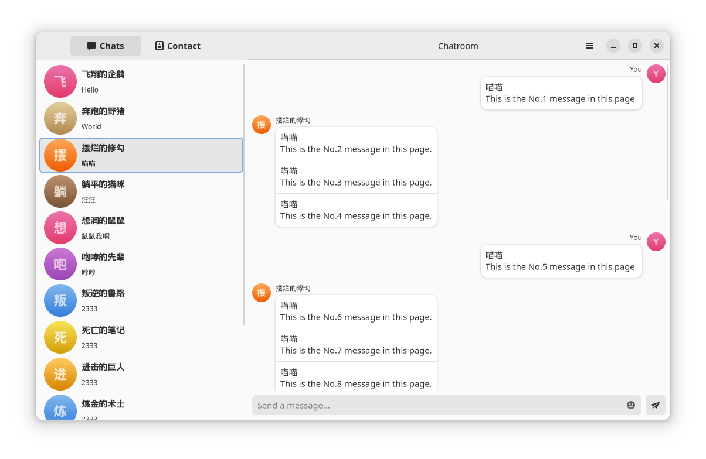
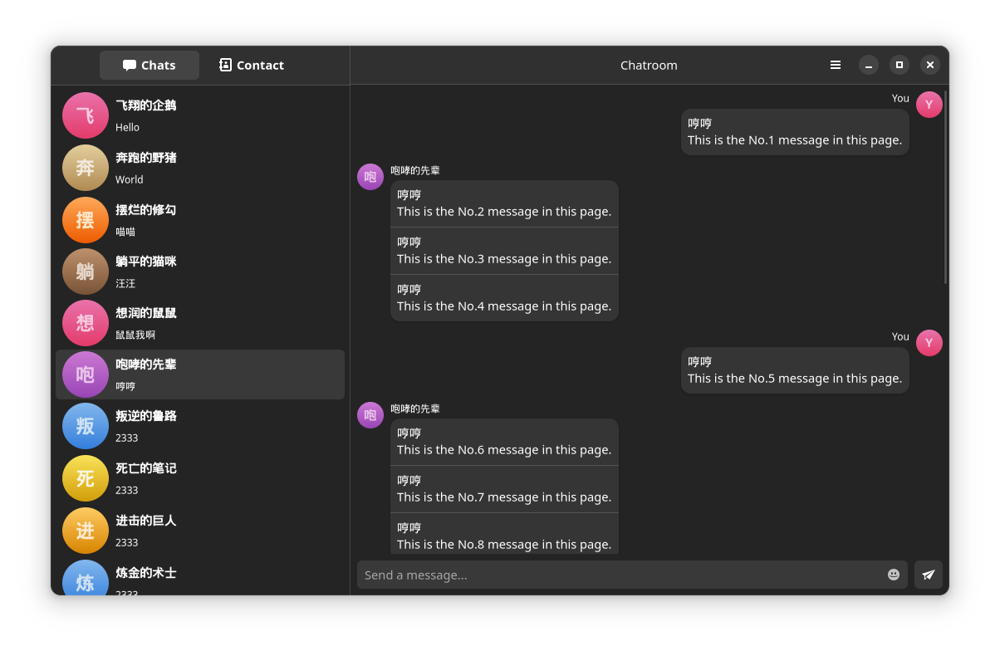

# GTK QQ

[![license-badge]][license-link]
[![dependency-badge]][dependency-link]
[![check-badge]][check-link]
[![build-badge]][build-link]

[license-badge]: https://img.shields.io/badge/License-AGPL%20v3-blue.svg
[license-link]: https://www.gnu.org/licenses/agpl-3.0
[dependency-badge]: https://deps.rs/repo/github/lomirus/gtk-qq/status.svg
[dependency-link]: https://deps.rs/repo/github/lomirus/gtk-qq
[check-badge]: https://github.com/lomirus/gtk-qq/workflows/check/badge.svg
[check-link]: https://github.com/lomirus/gtk-qq/actions/workflows/check.yaml
[build-badge]: https://github.com/lomirus/gtk-qq/workflows/build/badge.svg
[build-link]: https://github.com/lomirus/gtk-qq/actions/workflows/build.yaml


Unofficial Linux [QQ](https://im.qq.com/) client, based on GTK4 and libadwaita, developed with Rust and [Relm4](https://relm4.org/).

This app uses [ricq](https://github.com/lz1998/ricq) as the rust bindings of QQ APIs.

## Current Status

> **Warning**
>
> This project has been discontinued due to following reasons:
> - Tencent has released the official [Linux QQ](https://im.qq.com/linuxqq/index.shtml) in early 2023. Therefore this project may have copyright issues with it if continues.
> - This project is based on the `gtk-rs`. To be honest, it is a disastrous development experience with it. If I could restart this project, I would not choose this library anymore. I've tried Tauri before when it's only in v0.x, the development experience is fine but the webview it uses on linux is too old to support many new features on modern browers now at that time.
> - It is a very rare skill to develop app with `gtk-rs`. Only few people are able to contribute to this project, and the code quality is far from what I expected.
> - The owner and main maintainer of this repository @lomirus is busy with some other projects and affairs IRL, and he doesn't use QQ on Linux very much now. So for now, he doesn't have enough motivation on this project.
>
> However, you can still create any pull request if you want. And if you want to find any alternative, [Icalingua plus plus](https://github.com/Icalingua-plus-plus/Icalingua-plus-plus) would be a good choice (compared with the official one :p)

## Screenshots

| Light                                      | Dark                                     |
| ------------------------------------------ | ---------------------------------------- |
|  |  |

> **Note**
> 
> The two screenshots have been a little outdated. The UI now has been adjusted and improved compared to them.

## Installation

### AUR

For Arch users, you can install via the AUR package [gtk-qq-git](https://aur.archlinux.org/packages/gtk-qq-git):

```
paru -S gtk-qq-git
```

## Manual Build

### Requirements

You will need to install [Rust](https://www.rust-lang.org/tools/install) and [Meson](https://mesonbuild.com/Getting-meson.html) to build this project, and the necessary libraries below:

#### Ubuntu (>= 22.04)

```bash
sudo apt install gcc libssl-dev libsqlite3-dev libgtk-4-dev libadwaita-1-dev
```

#### Fedora

```bash
sudo dnf install gtk4-devel libadwaita-devel
```

#### Arch

```bash
sudo pacman -S pkgconf gtk4 libadwaita
```

#### Windows & MacOS

GTK4 projects would be more complex to compile on Windows/MacOS. Nevertheless, considering some special reasons that you know, we shall not offer the Windows/MacOS release or even build scripts. 

> **Warning**
> 
> You can try to build it still if you are just for personal use. At the same time, you should also promise that you will not distribute the Windows/MacOS build to the public in order to ensure the maintenance of this project.
> 
> The user builds, uses or distributes this project at the user's own risk. This project and its contributors assume no responsibility.

### Setup

You only need to run the commands below once unless you change the related codes.

```bash
# In the root directory of project
meson setup builddir
meson compile -C builddir
```

### Build

Switch to nightly toolchain before building.

```bash
# In the root directory of project
rustup override set nightly
cargo build --release
```

## Contributing

- You can feel free to use English or Chinese to open an issue or pull request.
- The commit message should follow the [Conventional Commits](https://www.conventionalcommits.org/en/v1.0.0/).
- If you want make changes to the UI part, read the [GNOME Human Interface Guidelines](https://developer.gnome.org/hig/index.html) before it.

## License

This repository is under the [AGPL-3.0 license ](https://github.com/lomirus/gtk-qq/blob/main/LICENSE).
